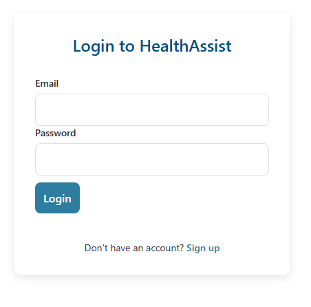
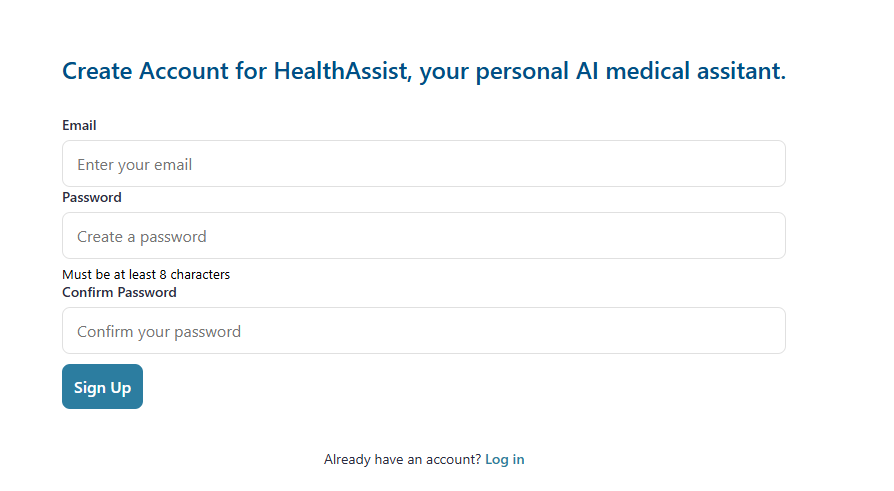
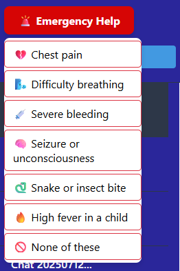
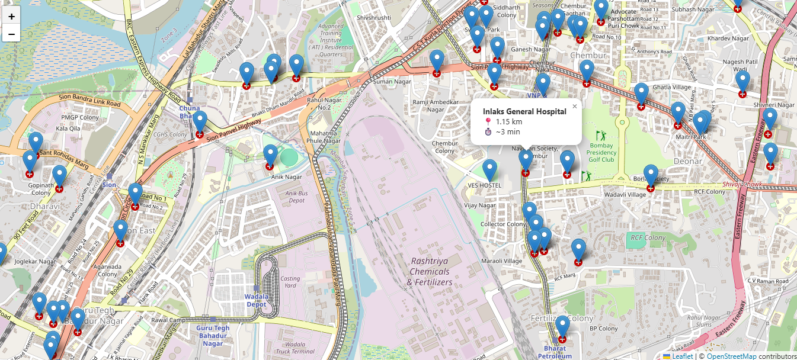
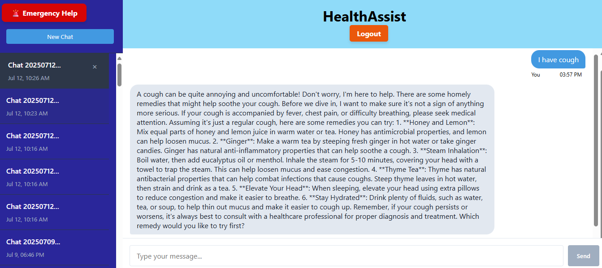
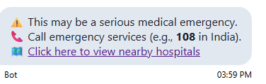

# 🩺 HealthAssist

**HealthAssist** is a smart AI-powered healthcare assistant that helps users with both **home remedies** and **emergency medical support** — all through a simple chatbot interface. Users can describe symptoms like **cough, fever, or headache**, and the chatbot suggests safe, natural remedies using common ingredients like honey, ginger, or lemon.

The app also includes an **emergency button** with a dropdown for common emergencies (e.g. heart attack, injury). When triggered, it shows **real-time nearby hospitals** using **OpenStreetMap API**, including **distance and estimated travel time** from the user’s location.

HealthAssist supports **user authentication**, **session history**, and full **CRUD operations** — so users can view, reuse, or delete past conversations. The app uses **GROQ API**, **LangChain**, and a custom **proxy server (Node.js)** for smooth backend communication. Built with **React**, **Flask**, and **MongoDB**, HealthAssist brings together AI, maps, and user-friendly healthcare tools in one integrated platform.

---

## 🌟 Features

- 🤖 **AI Chatbot (GROQ + LangChain)**  
  Real-time suggestions for home remedies based on symptoms.

- 🏥 **Emergency Button with Live Map**  
  Dropdown list of emergencies. On click, shows nearby hospitals with distance and travel time using **OpenStreetMap**.

- 💬 **Session History (CRUD)**  
  Users can save, delete, and reuse previous conversations. All sessions are stored and linked to the user account.

- 🔐 **User Authentication**  
  Sign up, log in, and secure session handling with persistent data.

- 🌐 **Proxy Server**  
  Node.js server handles CORS and API routing for seamless frontend–backend interaction.

---

## 🖼️ Screenshots

| Login | Signup |
|-------|--------|
|  |  |

| Emergency Dropdown | Emergency Map |
|--------------------|---------------|
|  |  |

| AI Chat | Emergency Response | Get Direction |
|--------|--------------------|---------------|
|  |  |  |


---

## 🛠️ Technologies Used

### Frontend:
- **ReactJS** – Interactive and responsive UI
- **JavaScript / HTML / CSS** – Web UI and styling

### Backend:
- **Python** – Core logic
- **Flask** – RESTful API server
- **Node.js (Proxy Server)** – Handles CORS & routing between APIs

### AI and Chat:
- **LangChain / LangGraph** – Manages AI flow and memory
- **GROQ API** – Powers the AI chatbot responses

### Mapping & Location:
- **OpenStreetMap API** – Provides real-time hospital locations and distance/time calculations

### Database:
- **MongoDB** – Stores user data, chat history, and sessions

---

## 📦 Setup Instructions

```bash
# 1. Clone the repository
git clone https://github.com/your-username/healthassist.git
cd healthassist

# 2. Set environment variables
# Create a .env file and include:
REACT_APP_API_URL=http://localhost:4000
REACT_APP_MAPBOX_TOKEN=your_mapbox_token
GROQ_API_KEY=your_groq_key

# 3. Backend setup (Flask)
cd backend
pip install -r requirements.txt
python app.py

# 4. Proxy server (Node.js)
cd proxy
npm install
node index.js

# 5. Frontend setup (React)
cd client
npm install
npm start

